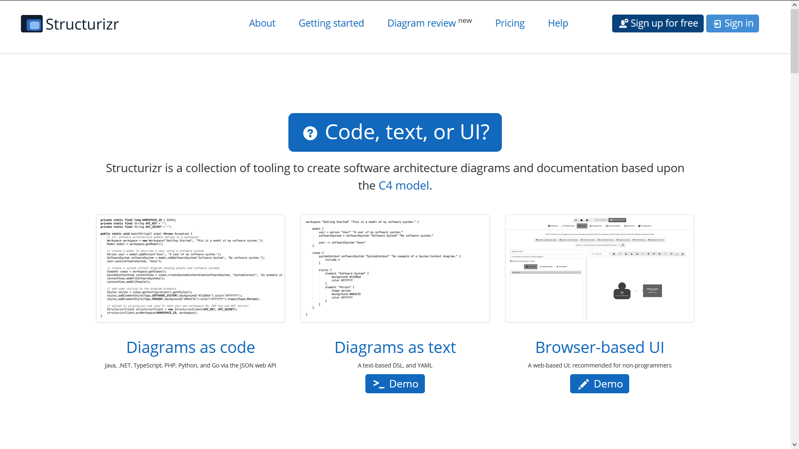
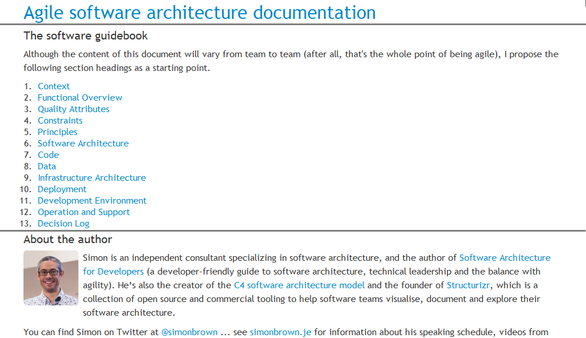

:icons: font
:revealjs_progress: true
:revealjs_previewLinks: true
:revealjs_mouseWheel: true
:revealjs_history: true
////
:revealjs_plugins: {slidesdir}/plugins.js
:revealjs_plugins_configuration: {slidesdir}/configs.js
////
:customcss: custom.css
:source-highlighter: highlightjs
:architecture: ../../../src/main/java/org/ndx/agile/architecture/documentation/system/Architecture.java

= Can C4 see forward ?

[NOTE.speaker]
--
Title is obvisouly a joke, and a lie.
We're not gonna talk only about C4, because Simon Brown explains his ideas way better than what I'll ever do.
In fact, we're gonna talk about ways to augment what C4 can easily do.
--

== Why documenting architecture ?

++++

<blockquote class="twitter-tweet">
Because the code is the truth, but not the whole truth.
&mdash; Grady Booch (@Grady_Booch) <a href="https://twitter.com/Grady_Booch/status/1253062981283221504?ref_src=twsrc%5Etfw">April 22, 2020</a></blockquote>  

++++

[NOTE.speaker]
--
There will be here a good bunch of discussion to have about socio-technical systems,
politics of the work place, and so on.
Sufice to say that that if the code correctly explains the "how" of a software product, it falls short to answer other questions.
--

=== Which questions should we answer to ?

* [line-through]#Who ?#
* When ?
* What ?
* [line-through]#Where ?#
* [line-through]#How ?#
* Why ?

=== How to answer these questions ?

image::https://media.giphy.com/media/j3cIiYP90ci1QgyWAk/giphy.gif[]

[NOTE.speaker]
--
Obviously, all these questions require communication for answering them ...
But which form can this communication take ?
--

[%notitle]
=== Some poor solutions (we all use)

|===
| | White board | | Dedicated tool

| Advantages
| Easy to use
|
| Complete

| Drawbacks
| No coherence
Unknown lifespan
|
| Hard to export
| Hard to embark in
|===

[NOTE.speaker]
--
Most often, the architects have a spectrum of tools that goes from the white board, be it physical or virtual (draw.io and the such) to dedicated tools (Archi, various UML modelers). These tools obviousl have different advantages,whcih come at the cost of drawbacks. Is it possible to envision tools mitigating those drawbacks to provide a tool useful to all team members.
--

== C4

* Context, Containers, Components, Code
* A classical metaphor : the map
* Envisoned par Simon Brown

[NOTE.speaker]
--
C4 concept is very simple, and that's why  it is so useful in these times of extreme simplification.
Model start from system context to end with code going through some detail levels.
--

=== An example ?

icon:github[set=fab] https://github.com/Riduidel/agile-architecture-documentation-system[agile-architecture-documentation-system]

[NOTE.speaker]
--
I could have chosen an external project, but it wouldn't have been any fun.
As a consequence, I've chosen to use this very project as an example of what can be done with this project.
--

=== Context

[plantuml, {plantumldir}SystemContext, svg, opts="interactive"]     
----
include::{structurizrdir}/SystemContext.plantuml[]
----

[NOTE.speaker]
--
Context diagram describes interactions of system with the all stakeholders : users, but also associated external systems.
It is a map ... at large scale.
Notice that colors can be freely chosen by team, provided the legend is explicit (which is a part of C4 prescriptions).
--

=== Containers

[%notitle]
=== Containers

[plantuml, {plantumldir}agile.architecture.containers, svg, opts="interactive", style="max-width:90%"]
----
include::{structurizrdir}/agile.architecture.containers.plantuml[]
----

[NOTE.speaker]
--
--

=== Containers - notes

* Containers may not be Docker containers.
* Containers may not be Maven/Gradle modules either.

* Containers must be signifiant elements of system architecture

[%notitle]
=== Components

[plantuml, {plantumldir}agile.architecture.base.components, svg, opts="interactive", style="max-height:90%"]
----
include::{structurizrdir}/agile.architecture.base.components.plantuml[]
----

=== Components - to note

* If your framework implements the components concept, that's cool!
** Spring
** GWT
** JavaEE (EJB)
** Swing
** VueJS

=== Code

Finally provides a link between your components and the code which implement them

[%notitle]
=== That's good ... but

image::https://media.giphy.com/media/YoWYbUDeJK6Telrvzs/giphy.gif[]

[%step]
* Diagrams may be potentially inconsistent
* Diagrams may not answer all questions
* Diagrams may not be up to date

[NOTE.speaker]
--
No map prevented someone to get lost
because the map is the geography, not the history
--

== How to add consistency to diagrams

[%step]
By basing them on a model

[%notitle]
=== Structurizr

=== A Structurizr context

[source,java]
----
include::{architecture}[tag=structurizr-example-context, indent=0]
----

=== Structurizr containers

[source,java]
----
include::{architecture}[tag=structurizr-example-containers, indent=0]
----

=== Structurizr components

[source,java]
----
include::{architecture}[tag=structurizr-example-components, indent=0]
----

=== Structurizr views

[source,java]
----
include::{architecture}[tag=structurizr-example-views, indent=0]
----

[%notitle]
=== That's good ... but

image::https://media.giphy.com/media/YoWYbUDeJK6Telrvzs/giphy.gif[]

[%step]
* Diagrams don't answer all the questions
* Diagrams may not be up to date

== How to tell the story ?

[%notitle]
=== With a good layout

[NOTE.speaker]
--
No map prevented someone to get lost
because the map is the geography, not the history
--

=== That's better but

image::https://media.giphy.com/media/fatcd1PnHPTDW/giphy.gif[]

* Diagrams may not be up to date

== What if ...

[%step]
* We used the DRY principle
* In other words, I show you what I do

=== We already have the infos

* Where are our containers ?
** In maven ? We can find them
** in Kubernetes ? We can find them
* Where are our components ?
** In maven ? We can find them

=== We alreayd know how to prouce complex code

* We do CI/CD on products way more complex than documentation
* We already have advanced code industrialization

[%notitle,background-iframe="https://riduidel.github.io/agile-architecture-documentation-system/"]
=== architecture-as-code

=== With that, everything is possible !

++++

<blockquote class="twitter-tweet">
As an example, I&#39;ve already used Hashicorp Vault Java client, GitHub client API and Kubernetes client to populate my model from informations already existing, so I guess it&#39;s possible to get users/containers/components from a reference system ...
&mdash; Nicolas Delsaux (@riduidel) <a href="https://twitter.com/riduidel/status/1280395424654901248?ref_src=twsrc%5Etfw">July 7, 2020</a></blockquote>  

++++

== Thanks !

image::https://media.giphy.com/media/1sMH6m5alWauk/giphy.gif[width=200%]