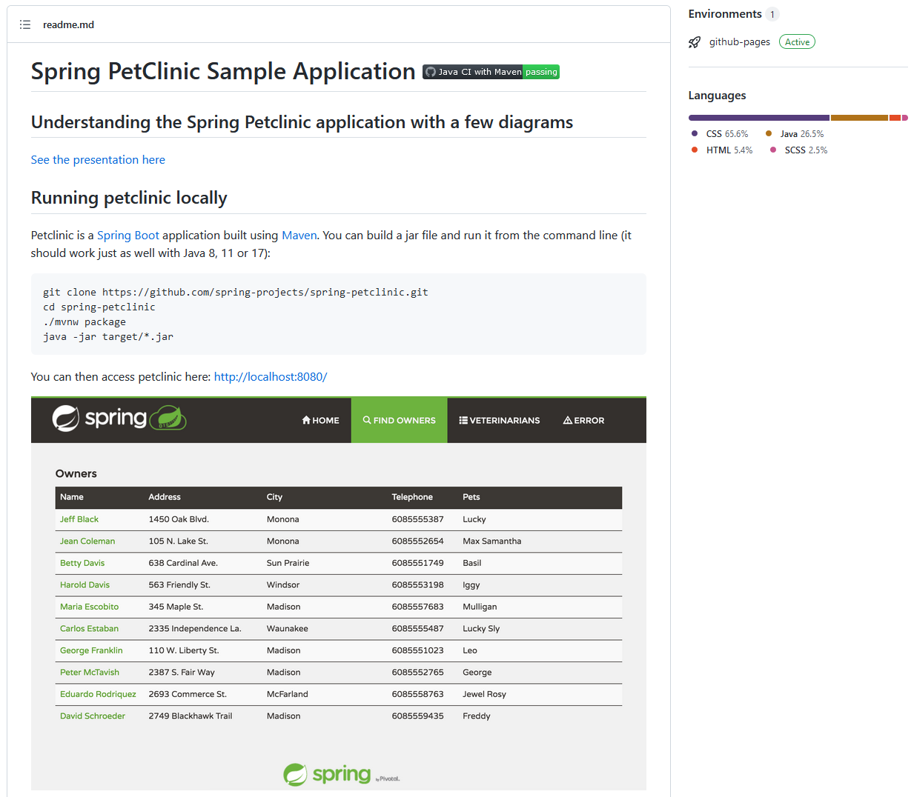
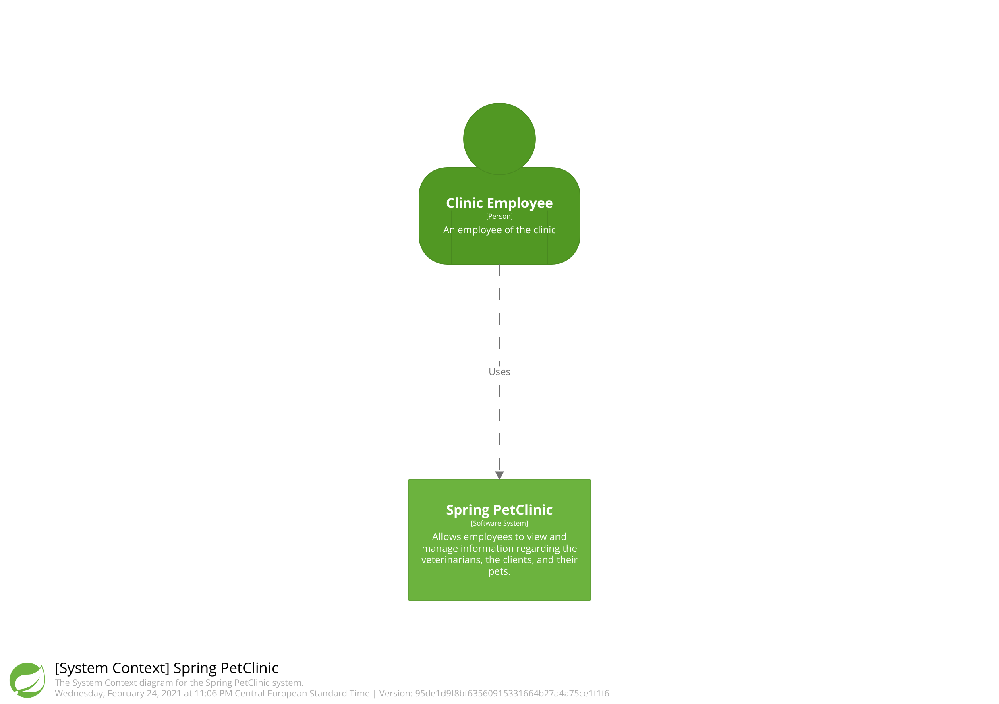
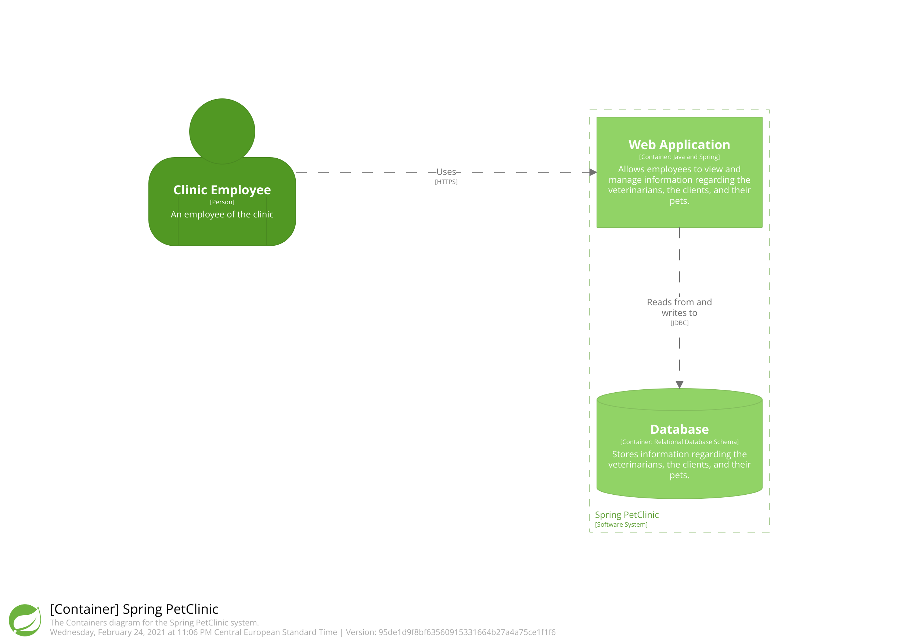
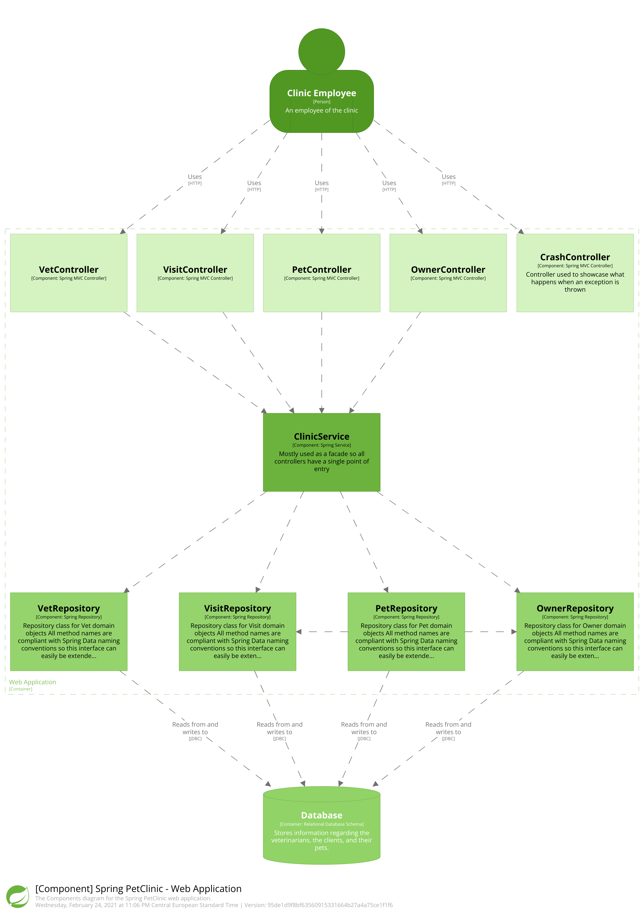
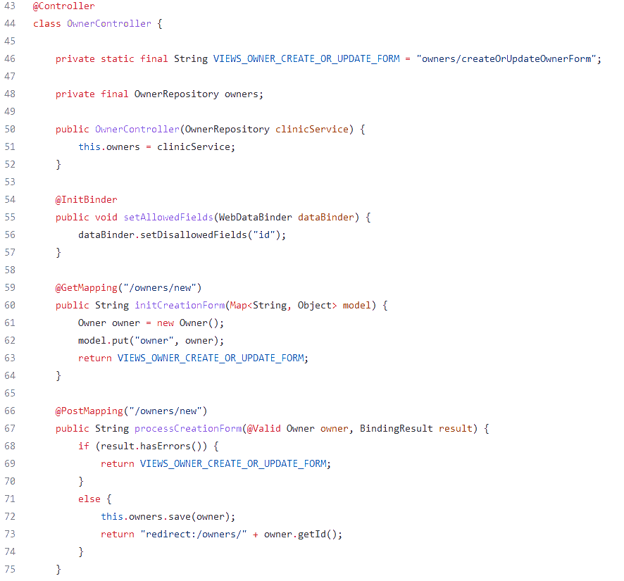

:icons: font
:revealjs_theme: solarized
:revealjs_slideNumber: false

:revealjs_progress: true
:revealjs_previewLinks: true
:revealjs_mouseWheel: true
:revealjs_history: true
:revealjs_preloadIframes: true
:revealjs_plugin_notes: enabled
:customcss: custom.css
:source-highlighter: highlightjs
:city: lille

[%notitle]
= Pourquoi aadarchi ?
:sectnums!:

[NOTE.speaker]
--
--

////
[%notitle]
== Qui suis-je ?

Nicolas Delsaux / https://stackexchange.com/users/8620[icon:stack-overflow[]] / https://www.linkedin.com/in/nicolasdelsaux/[icon:linkedin[]] / https://framapiaf.org/users/riduidel[@riduidel@framapiaf.org on 🐘]

Développeur Java depuis l'an 2000

Architecte de solutions/systèmes depuis 2015

image::images/zenika.png[height=100]

[NOTE.speaker]
--
En tant que développeur et architecte, je me suis beaucoup intéressé à la question de la documentation d'architecture.
--
////

== Pourquoi documenter l'architecture ?

++++

<blockquote class="twitter-tweet">
Because the code is the truth, but not the whole truth.
&mdash; Grady Booch (@Grady_Booch) <a href="https://twitter.com/Grady_Booch/status/1253062981283221504?ref_src=twsrc%5Etfw">April 22, 2020</a></blockquote>  

++++

[NOTE.speaker]
--
On pourrait parler de politique dans les entreprises,
de systèmes socio-techniques, etc...
Mais en fait, c'est tellement plus simple de dire que si le code explique correctement le "comment" d'un logiciel,
il ne répond pas à quelques autres questions
--

[.columns]
=== Comment documenter l'architecture ?

[.column]
* **Outil dédié**
** Complet icon:check-circle[role=green]
** Difficile à exporter icon:times-circle[role=red]
** Difficile de monter en compétence icon:times-circle[role=red]

[.column]
* **Tableau blanc** (physique ou virtuel)
** Facile à utiliser icon:check-circle[role=green]
** Aucune cohérence icon:times-circle[role=red]
** Durée de vie inconnue icon:times-circle[role=red]

[NOTE.speaker]
--
La plupart du temps, les architectes disposent d'un spectre d'outils allant du tableau blanc, qu'il soit physique ou virtuel (draw.io, Miro, Mural, ...), aux outils dédiés (Archi, les outils UML, ...).
Ces outils ont évidement des avantages diférents, associés à des inconvénients différents.
Sans doute parce qu'ils s'adressent à des publics *très* différents, dans des phases différentes du cycle de vie de l'application.
Et quand on regarde, il semble évident qu'il puisse exister un outillage entre ces deux extrêmes, disposant de qualités différentes, pour fournir un outil utile aux différents membres de l'équipe.
--

[.columns]
== C4

[.column]

[.column]
* Context, Containers, Components, Code
* La métaphore classique de la carte
* Imaginé par Simon Brown (https://twitter.com/simonbrown[icon:twitter[] @simonbrown])

[NOTE.speaker]
--
Le concept de C4 est très simple, et c'est la raison pour laquelle il est aussi utile dans une période de simplification.
On part du contexte du système pour arriver au code en passant par deux étages intermédiaires.
Simon Brown habite Jersey, et du coup il fait d'habitude une présentation qui emmène les gens jusque sur son île.
Aujourd'hui, on est à Grenoble, on va donc plutôt vous emmener jusqu'ici ...
--

////
[%notitle, background-color="white"]
=== Un exemple rapide ?

[NOTE.speaker]
--
**Demander qui connaît PetClinic**

Histoire de se fixer les idées, on va partir d'un projet plutôt connu dans le monde Java : icon:github[set=fab] https://github.com/spring-projects/spring-petclinic#readme[spring pet clinic].
C'est un exemple d'application Spring assez simple qui leur permet d'exposer les différentes fonctionnalités
--
////

[%notitle]
=== C4 en un slide

[cols="4", width="100%", frame=none, grid=none]
|===
|
image:images/{city}/context.png[width="300"]
|
image:images/{city}/containers.png[width="300"]
|
image:images/{city}/components.png[width="300"]
|
image:images/{city}/code.png[width="300"]
|

|

|

|

|===

[%notitle]
=== C'est bien, mais

image::https://media.giphy.com/media/YoWYbUDeJK6Telrvzs/giphy.gif[]

[%step]
* Les diagrammes peuvent être inconsistants
* Les diagrammes ne peuvent pas répondre à toutes les questions
** On n'a pas parlé des différents déploiements (dev vs préprod vs prod)
* Les diagrammes peuvent ne pas être à jour

[NOTE.speaker]
--
On va d'abord se concentrer sur le premier point (sinon je ne l'aurais pas mis en premier).
--

== Comment rendre les diagrammes consistants

[%step]
En les basant sur un modèle !

[%notitle, background-iframe="https://c4model.com/"]
=== Heureusement, il y a de l'outillage !

[NOTE.speaker]
--
**ATTENTION: PENSER à CLIQUER SUR LE LIEN "TOOLING" **

Sur le site de https://c4model.com/#Tooling[C4Model], on trouve tout un tas d'outils permettant de baser nos diagrammes sur un modèle, et donc d'apporter de la consistance.
On va évidement parler de Structurizr
--

[%notitle, background-iframe="https://structurizr.com/"]
=== Structurizr

[NOTE.speaker]
--
Le fait que C4 ne soit qu'un dessin est un inconvénient connu de son créateur, Simon Brown, qui a développé une suite d'outils, collectivement appelés Structurizr.
On a donc 

* Un DSL basé sur Kotlin (qu'on va tout de suite tester)
* Un outil d'affichage des diagrammes en local (structurizr-lite) et en SaaS (Structurizr)
* Des librairies permettant de créer des modèles d'architecture dans un certain nombre de langages
--

[%notitle]
=== C'est bien, mais

image::https://media.giphy.com/media/YoWYbUDeJK6Telrvzs/giphy.gif[]

[%step]
* +++<s>Les diagrammes peuvent être inconsistants</s>+++
* Les diagrammes ne peuvent pas répondre à toutes les questions
** +++<s>On n'a pas parlé des différents déploiements (dev vs préprod vs prod)</s>+++
* Les diagrammes peuvent ne pas être à jour

[NOTE.speaker]
--
On va d'abord se concentrer sur le premier point (sinon je ne l'aurais pas mis en premier).
--

== Comment faire vivre les diagrammes avec le code ?

[%step]
* Démarrer structurizr "pendant le build"
* Publier les artefacts comme des artefacts du code ?
* Lire le code pour "augmenter" les diagrammes

[%notitle, background-iframe="https://riduidel.github.io/aadarchi/"]
=== Aadarchi

== Philosophie d'Aadarchi

[%notitle, background-iframe="https://www.writethedocs.org/guide/docs-as-code/"]
=== Embracer le doc as code

[%notitle, background-iframe="https://plantuml.com/fr/"]
=== Utiliser PlantUML pour le rendu des diagrammes

[%notitle, background-iframe="https://weld.cdi-spec.org/"]
=== Utiliser CDI pour rendre ces visites extensibles

[%notitle, background-iframe="https://refactoring.guru/design-patterns/visitor#structure"]
=== Visiter le modèle pour l'enrichir

== Break

== Comment aider ?

* Aadarchi est un projet open-source stocké sur GitHub
* pour lequel on utilise les fonctionnalités de GitHub (Issues, Actions, ...)

[%notitle, background-iframe="https://seantrane.com/posts/logical-colorful-github-labels-18230/#label-groups"]
=== Organisation des issues GitHub

[%notitle, background-iframe="https://github.com/Riduidel/aadarchi/issues"]
=== Les tickets Aadarchi en général

=== Comment s'organiser ?

[%step]
* On peut se revoir demain pour monter en compétences ensemble
* Un daily ?
* Une démo le Lundi 5 août ?

[.columns]
== Références

* https://www.c4model.com[C4Model]
* https://www.structurizr.com[Structurizr]
* https://github.com/structurizr/java-extensions/blob/master/docs/spring-petclinic.md[Structurizr appliqué à Spring Pet Clinic]
* Slides disponibles sur https://github.com/Riduidel/conferences/c4_et_au-dela/src/slides/asciidoc
